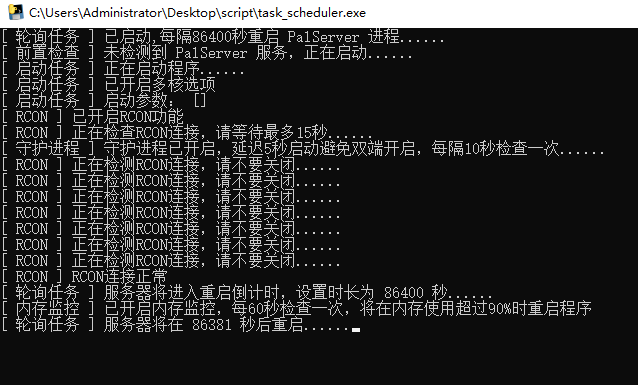

# palworld-python-script

_✨ Suitable for palworld windows polling auto-restart server and auto-send shutdown notifications ✨_

[简体中文](./README.md) / English  

## Special Thanks  
https://github.com/VeroFess/PalWorld-Server-Unoffical-Api  
This project uses the DLL injection provided by VeroFess, which allows us to send Chinese messages via RCON. We appreciate VeroFess's selfless sharing.  

## Main Features  

1. Polling task to restart the server  
2. Send shutdown countdown via RCON commands before server restart  
3. Customize the backup time of the archive  

## Development Plan  

- [x] Added custom startup parameters
- [x] Customized shutdown countdown notification content (currently unable to send in Chinese)
- [x] Added daemon process
- [x] Switched rcon-cli client to third-party rcon library
- [x] Memory usage percentage detection
- [x] Countdown notification for restart when memory reaches threshold

## Instructions for Use  
 
1. Download the latest installation package from Releases  
https://github.com/Cassianvale/palworld-python-script/releases  
2. There are two exe programs, one is `task_scheduler.exe` for polling, restarting daemon processes, etc., and the other is `backup.exe` for independent timed backup of archives. Both must be run in the same directory as the `config.ini` configuration file.  
3. Modify the `config.ini` configuration file. Detailed instructions are provided in the configuration file.  

## Usage  

1. Ensure that you have Python environment version 3.10 or higher installed.  
2. Run the command `pip install -r requirements.txt -i https://pypi.tuna.tsinghua.edu.cn/simple` to install the dependencies.  
3. Run the Python script from the console `python pyinstaller.py` to package `backup.exe`, `task_scheduler.exe`, and `config.ini`.
4. Configure `config.ini` and run it in the same directory as the exe program.  
For specific usage, please refer to the Feishu document  
https://cxqzok4p36.feishu.cn/docx/YxPtdYoqCo5PdfxSyNgcDfIwnwe  

## Thanks  
rcon  
https://github.com/conqp/rcon  